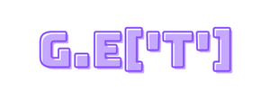

<p align="center"><a href="#" target="_blank"></a></p>

<p align="center">
 <a href="#about">About</a> •
 <a href="#usage">Usage</a> •
 <a href="#technologies">Technologies</a> •
 <a href="#author">Author</a> •
 <a href="#license">License</a>
</p>

<br/>

## About
get is just a simple snippet function used to access keys of javascript object that may or may not be present. If its present, the value of the key will be returned, otherwise fallback value will returned. It's simple and it goes well with frameworks like alpinejs where it is not easy to transpile with tools like Babel

## Usage
```javascript
let data = {
    a: [
        {},
        {},
        {
            b: {
                c: {
                    d: 12345
                }
            }
        }
    ]
};

get(data, 'a.b.c.d.e.f.0.g'); // Not exists. Outputs: null
get(data, 'a.2.b.c.d'); // Exists! Outputs: 12345
```

## Technologies
Pure vanilla JavaScript. No frameworks needed.

## Author
[paulocjota](https://github.com/paulocjota)

## License
The get function is open-sourced software licensed under the [MIT license](https://opensource.org/licenses/MIT).
